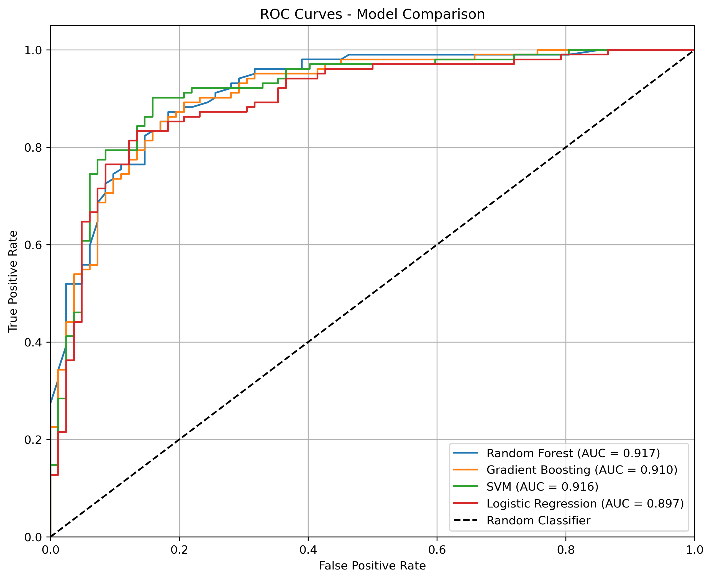
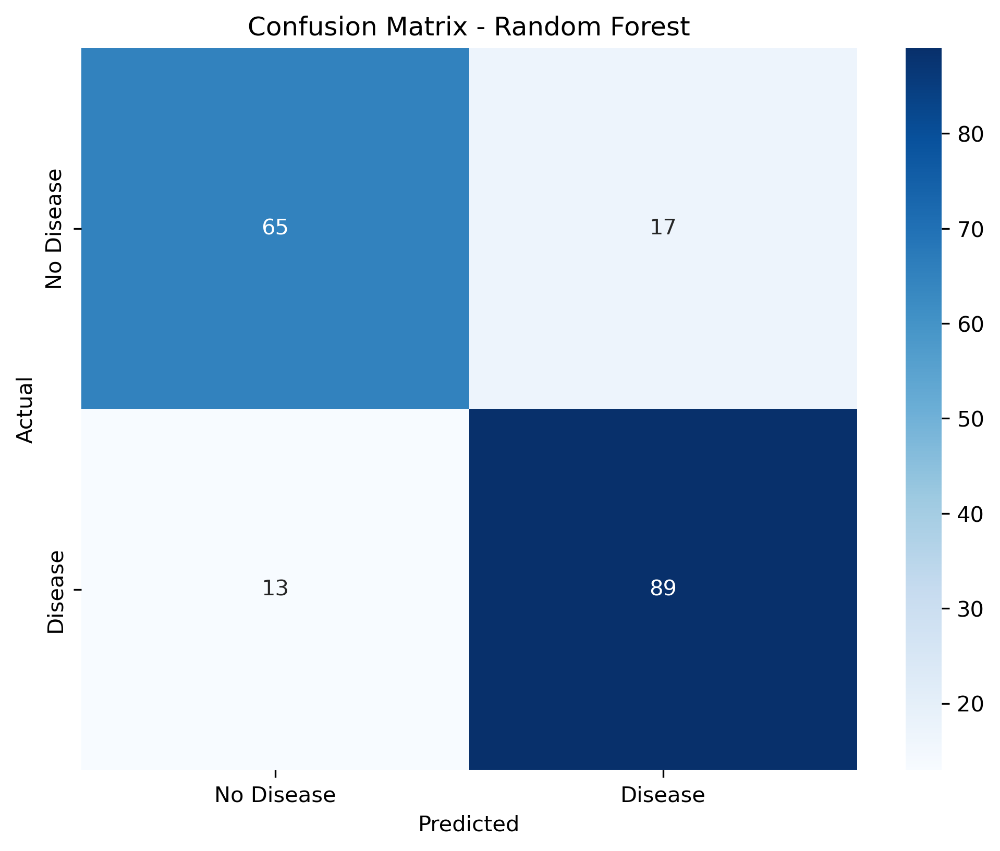
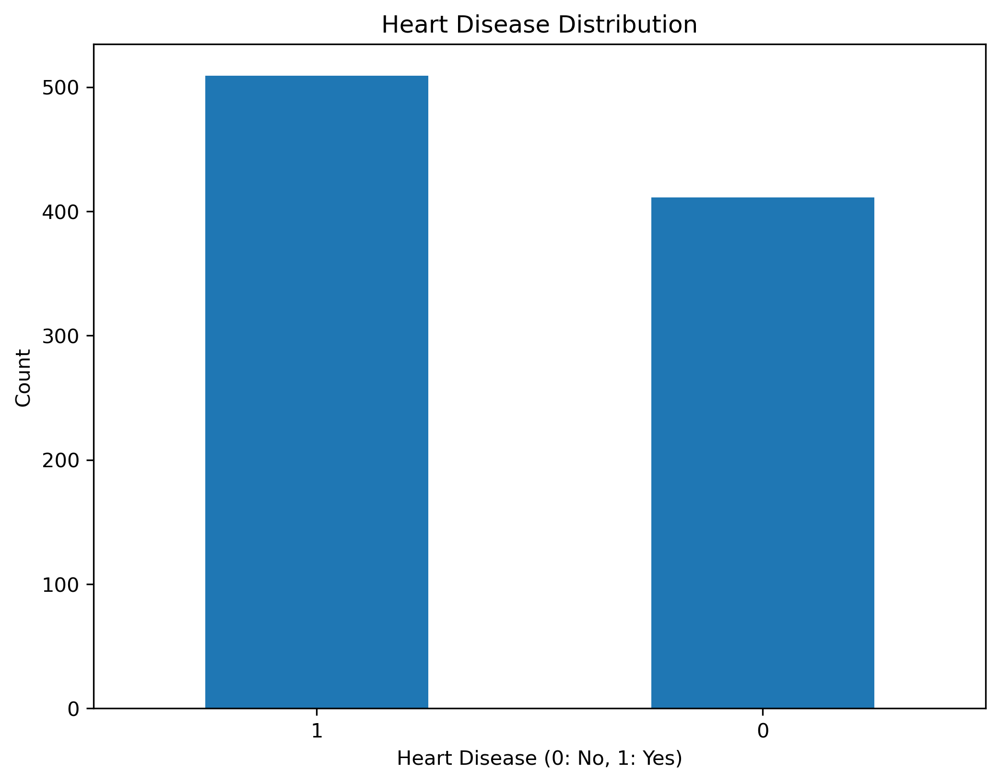
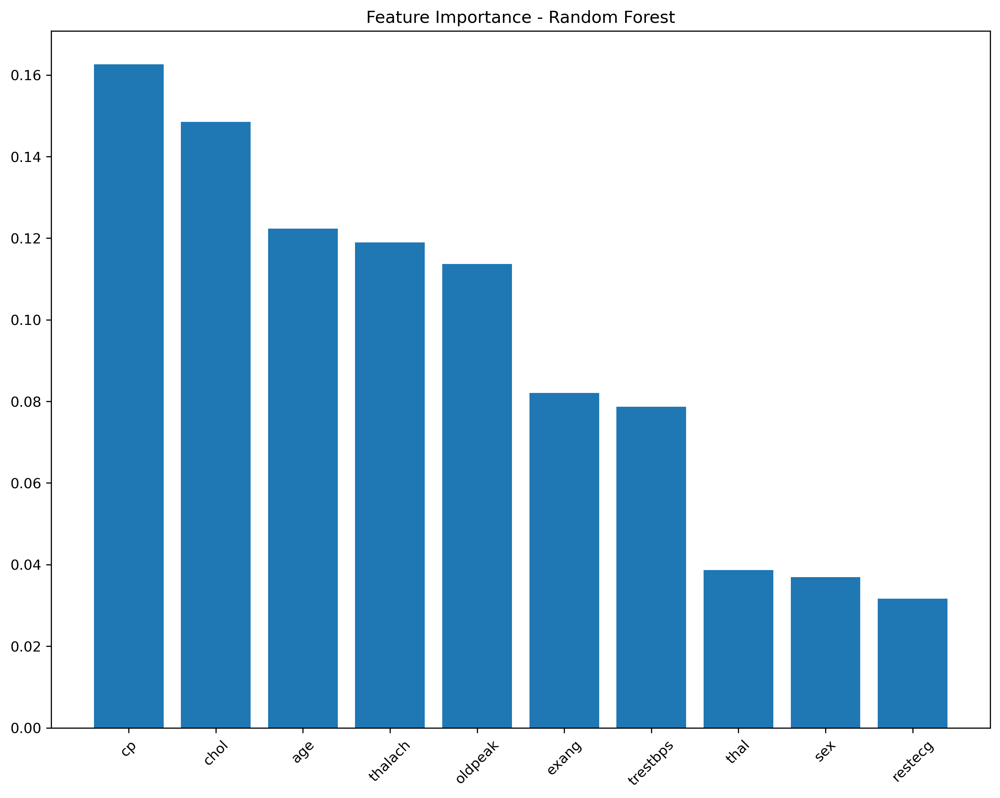
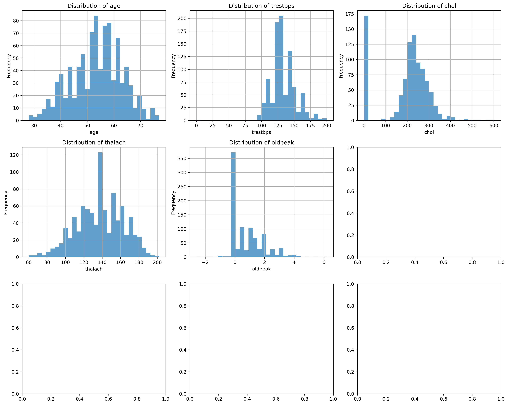
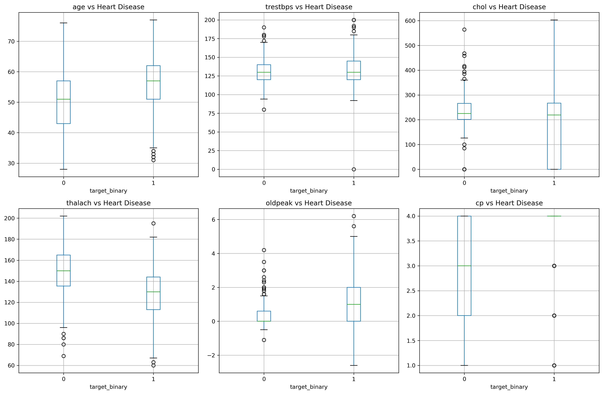

# ❤️ Heart Disease Prediction Project

A **comprehensive machine learning solution** for predicting heart disease risk — featuring a clean **Streamlit web interface**, robust **ML pipeline**, and insightful visualizations.

---

## 🧠 Overview
This project leverages **machine learning models** to predict the likelihood of heart disease based on patient data. It includes data preprocessing, model training, evaluation, and a web app for real-time predictions.

---

## 📂 Project Structure
```
├── app.py                    # Streamlit web application
├── AUTHORS.txt               # Author(s)
├── images                    # Generated plots and visualizations
├── main.py                   # Entry point
├── models                    # Trained models
├── predictor
│   ├── config.py             # Configuration settings
│   ├── core.py               # Main ML pipeline
│   └── __init__.py
├── README.md                 # Project documentation
└── requirements.txt          # Python dependencies
```

---

## ⚙️ Installation

1. **Clone the Repository**
   ```bash
   git clone https://github.com/kvernet/heart-disease-predictor.git
   cd heart-disease-project
   ```

2. **Install required packages**
   ```bash
   pip install -r requirements.txt
   ```

---

## 🚀 Usage

### 1️⃣ Train the Model
```bash
python main.py
```
This will:
- Download and preprocess the dataset
- Train multiple ML models (RF, SVM, GB, LR)
- Evaluate and select the best-performing model based on **AUC score**
- Save the model in the `models/` folder
- Generate visualizations in `images/`

### 2️⃣ Run the Web Application
```bash
streamlit run app.py
```
Then open your browser at [http://localhost:8501](http://localhost:8501).

---

## 🌟 Features

### 🧩 Machine Learning Pipeline
- Data loading from the UCI Repository  
- Robust preprocessing & feature engineering  
- Model training and performance evaluation  
- Model persistence and reusability  

### 💻 Web Application
- Intuitive, user-friendly interface  
- Real-time risk prediction  
- Interactive visualizations  
- Feature importance analysis  
- Fully mobile-responsive design  

---


## 📊 Project Dashboard & Visualizations

### Model Performance
| | |
|:---:|:---:|
| **ROC Curves** | **Confusion Matrix** |
|  |  |
| *Model comparison using AUC scores* | *Best model performance on test data* |

The following models are trained and compared automatically:
- **Random Forest**
- **Gradient Boosting**
- **Support Vector Machine**
- **Logistic Regression**

The **best model** (automatically selected based on AUC) is saved and deployed for predictions.

### Data Analysis
| | |
|:---:|:---:|
| **Target Distribution** | **Feature Importance** |
|  |  |
| *Heart disease case distribution* | *Top predictive features* |

### Feature Analysis
| | |
|:---:|:---:|
| **Feature Distributions** | **Correlation Heatmap** |
|  |  |
| *Clinical feature distributions* | *Feature relationships* |

### Target Relationships

*How features correlate with heart disease presence*

---

## 🧩 API Usage

```python
from predictor import HeartDiseasePredictor

# Load trained model
predictor = HeartDiseasePredictor()
predictor.load_model('models/heart_disease_best_model.pkl')

# Make a new prediction
patient_data = {
    'age': 45, 'sex': 1, 'cp': 2, 'trestbps': 130, 'chol': 240,
    'fbs': 0, 'restecg': 1, 'thalach': 150, 'exang': 0,
    'oldpeak': 1.2, 'slope': 2, 'ca': 0, 'thal': 3
}

result = predictor.predict_new_patient(patient_data)
print(result)
```

---

## ☁️ Deployment

### 🖥 Local Deployment
```bash
streamlit run app.py
```

### 🌍 Cloud Deployment
Easily deploy on:
- [Streamlit Cloud](https://streamlit.io/cloud)
- [Heroku](https://heroku.com)
- [AWS EC2](https://aws.amazon.com/ec2/)
- [Google Cloud Run](https://cloud.google.com/run)

---

## 🧾 License
This project is licensed under the **MIT License** — feel free to use and modify it!

---

## 🧑‍💼 Built with ❤️ for ❤️
This project highlights:
- **Full ML workflow expertise** — from data to deployment  
- **Clean, interactive UI** built with **Streamlit**  
- **Professional documentation** and modular structure  

---

## 👨‍💻 Developer Information

**Kinson VERNET**  
*Machine Learning Specialist & Data Scientist*

- **GitHub**: [kvernet](https://github.com/kvernet)
- **LinkedIn**: [kvernet](https://linkedin.com/in/kvernet)
- **Website**: [kvernet.com](https://kvernet.com)
- **Email**: kinson.vernet@gmail.com

---
**⭐ Star this repo** if you find it helpful!